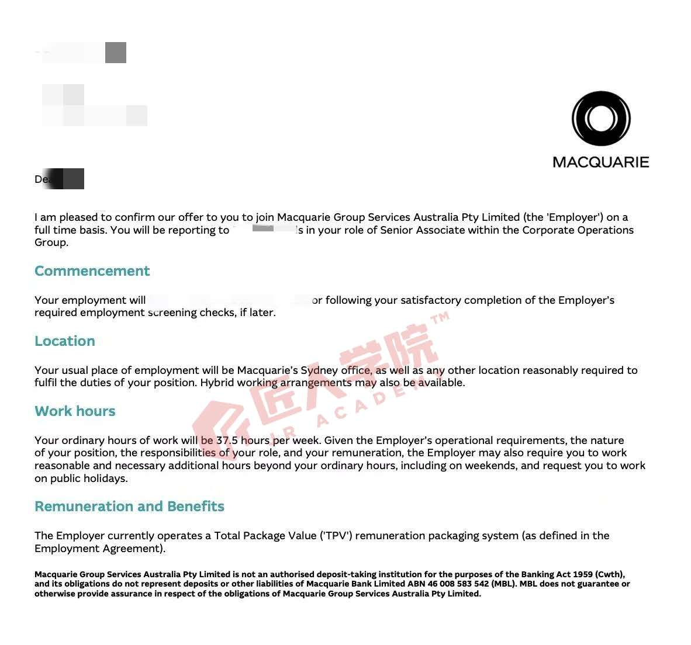

# Offer 喜报 · Daisy

> 内部受控归档 · 敏感信息（薪资等）仅内部备查，不外发；对外做喜报前需脱敏 + 本人同意。

- **学员**：Daisy
- **期数 / 来源**：AI Engineer 02 期
- **匠人项目**：未提供（汇总表中无）
- **Offer 岗位**：Senior Associate（Macquarie · Corporate Operations Group）/ Mid AI Engineer（PWC）
- **Offer 公司**：Macquarie / PWC（两份 offer）
- **薪资范围**：11.6W（Macquarie）/ 10.6W（PWC）〔敏感〕
- **日期**：2025-11-11
- **地点**：Sydney（Macquarie，Hybrid 可选）· 37.5 小时/周
- **收集日期**：2026-07-14（来源：Beta AI Engineer offer 统计）

## Offer 截图

> 上图为 **Macquarie**（Senior Associate · Corporate Operations Group）的 offer；姓名 / 日期 / 汇报人已打码，无薪资数字，带匠人水印。
> PWC（Mid AI Engineer）那份如有截图，存 `daisy-offer-pwc.png` 再补引用即可。
