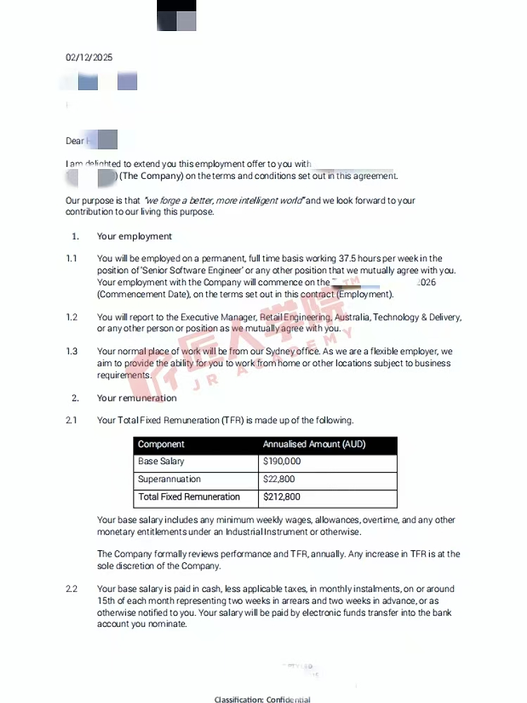

# Offer 喜报 · Harris

> 内部受控归档 · 敏感信息（薪资等）仅内部备查，不外发；对外做喜报前需脱敏 + 本人同意。

- **学员**：Harris
- **期数 / 来源**：AI Engineer 02 期
- **匠人项目**：未提供（汇总表中无）
- **Offer 岗位**：Senior AI Engineer
- **Offer 公司**：Quantium / Future Secure AI
- **薪资范围**：20W+〔敏感〕
- **日期**：2025-11-28
- **收集日期**：2026-07-14（来源：Beta AI Engineer offer 统计）

## Offer 截图

> ⚠️ 本图**含明文薪资**（Base $190,000 / Super $22,800 / TFR $212,800）。按 Beta「薪资原样保留」的决定留存于本内部受控库，**仅内部备查、不得外发**；对外做喜报务必先打码。姓名 / 公司已打码，带匠人水印。
