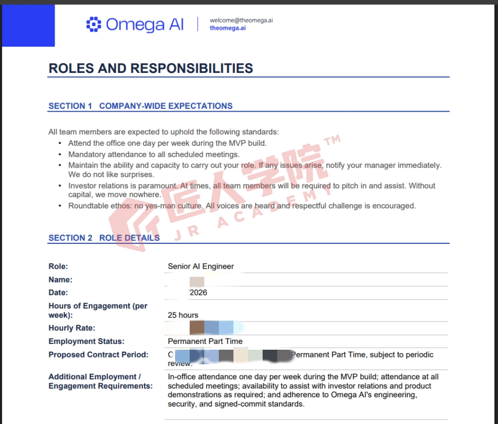

# Offer 喜报 · Rick（周大同 / Datong Zhou）

> 内部受控归档 · 决策（Beta 2026-07-07）：**薪资打码后再入库**——本记录已隐去明文薪资，
> 岗位 / 公司 / 期数作为 outcome 证明留在全员库；薪资明细如需查看走 jr-hr / 原件。
> ⚠️ 入库截图 `rick-offer.jpg` 的薪资（Hourly Rate）、姓名和起始日期均已打码。对外做喜报前仍需本人同意并再次复核脱敏。

- **学员**：Rick（周大同 / Datong Zhou）
- **期数**：AI Engineer 02 期
- **Offer 公司**：Omega AI（theomega.ai）— 这是 Rick 的 offer 雇主
- **匠人项目**：未提供
- **Offer 岗位**：Senior AI Engineer
- **地点**：In-office 1 天/周（MVP 阶段）
- **雇佣性质**：Permanent Part Time · 25 小时/周
- **薪资**：〔敏感 · 不明文归档，如需查看见 jr-hr / 原件〕
- **合同**：Ongoing，commenced 15/04/2026，定期 review
- **文件日期**：23/06/2026
- **收集日期**：2026-07-07（收集人：Beta）

## Offer / 岗位职责内容（据 Roles & Responsibilities 文档截图转录）

来自 Omega AI 的 "ROLES AND RESPONSIBILITIES" 文档：

- **Section 1 · Company-wide expectations**：每周到岗 1 天（MVP build 期间）；必须参加所有既定会议；保持履职能力，有问题第一时间告知 manager；investor relations 优先，必要时全员协助；roundtable ethos——无唯命是从文化，鼓励有理有据地 challenge。
- **Section 2 · Role details**：
  - Role: Senior AI Engineer
  - Name: Datong (Rick) Zhou
  - Date: 23/06/2026
  - Hours of Engagement: 25 hours/week
  - Hourly Rate: 〔已隐去 · 敏感薪资不明文归档，见 jr-hr / 原件〕
  - Employment Status: Permanent Part Time
  - Proposed Contract Period: Ongoing, commenced 15/04/2026, Permanent Part Time, subject to periodic review
  - Additional requirements: MVP 阶段每周到岗 1 天；参加所有既定会议；随需协助 investor relations 与产品演示；遵守 Omega AI 的 engineering / security / signed-commit 规范。

## Offer 截图

> 图中薪资（Hourly Rate）/ 姓名 / 起始日期等敏感信息已打码，并加匠人学院水印。
